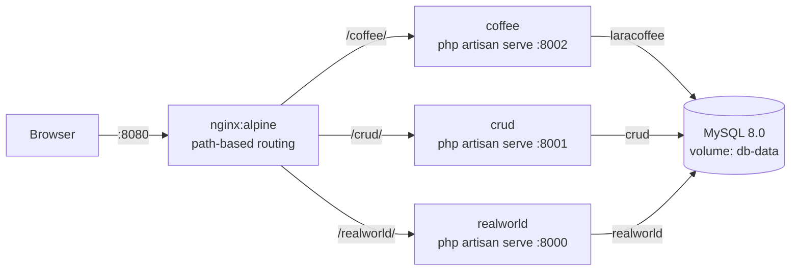

# Laravel Multi-App Docker Stack

Three independent Laravel applications (`coffee`, `crud`, `realworld`) running in separate containers behind one Nginx reverse proxy, sharing a single MySQL 8 server with one database per app.

## Architecture



Only Nginx publishes a port. The apps wait for the MySQL healthcheck before starting.

## Stack

| Layer | Tech |
|---|---|
| Proxy | Nginx (alpine) |
| Apps | Laravel on PHP 8.4 (`coffee`, multi-stage build with Composer and Node 20); `crud` and `realworld` use a PHP/Composer base image |
| Database | MySQL 8.0, databases created by `mysql/init.sql` |
| Orchestration | Docker Compose |
| CI | GitHub Actions: php -l, composer validate, compose config, hadolint, Trivy |

## Quick start

```bash
git clone https://github.com/frenzyali/3-Tier-Laravel-Application-Deployment.git
cd 3-Tier-Laravel-Application-Deployment
cp -r envs.example envs     # then edit the passwords; envs/ is gitignored
docker compose up --build
```

- http://localhost:8080/coffee/
- http://localhost:8080/crud/
- http://localhost:8080/realworld/

The `coffee` app's shipping-cost feature needs a RajaOngkir starter API key in `envs/coffee.env` (`API_RAJAONGKIR`).

## Design decisions

- **One MySQL server, three databases.** `init.sql` creates the databases and grants a single app user access. This keeps the stack light; the trade-off is that the apps share a failure domain and one user.
- **Secrets stay out of the repo.** Credentials live in `envs/*.env` (gitignored) and are passed with `env_file`. `envs.example/` shows the required keys.
- **Ordered startup.** The `db` service has a `mysqladmin ping` healthcheck and the apps use `depends_on: condition: service_healthy`. `coffee` and `crud` entrypoints also poll the DB with PDO before migrating.
- **Path-based routing.** Nginx strips the prefix (`proxy_pass http://app:port/`) so each app can be served at its own sub-path without changes to Nginx per app.
- **Per-app `.env.example`.** Each Dockerfile copies `.env.example` to `.env` and generates an app key at build time. Real DB settings override it at runtime via compose environment.

### Known limitations

- Apps run with `php artisan serve` (dev server), not PHP-FPM.
- Dockerfiles run `composer update`, so builds are not reproducible. `composer install` against the lockfile would be.
- Because Nginx strips the path prefix, absolute asset URLs (`/css/...`) inside the apps may not resolve under `/coffee/`; that depends on each app's `APP_URL`/`ASSET_URL` setup.
- `realworld/database/database.sqlite` is committed (schema only, no rows). It is unused by this MySQL setup and can be removed.

## Cleanup

```bash
docker compose down -v      # stop containers and delete the MySQL volume
docker image prune -f       # remove dangling build layers
rm -rf envs                 # remove local credentials
```
